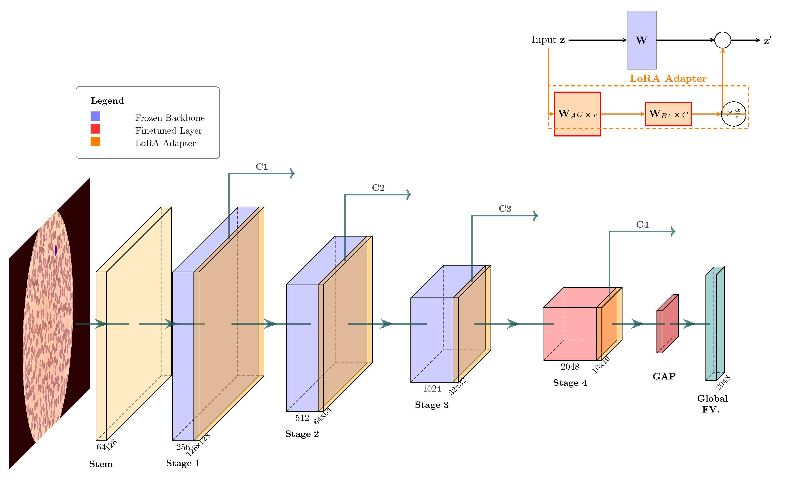
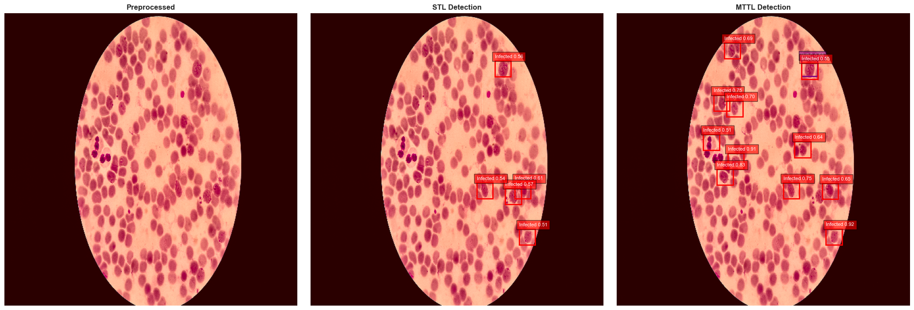
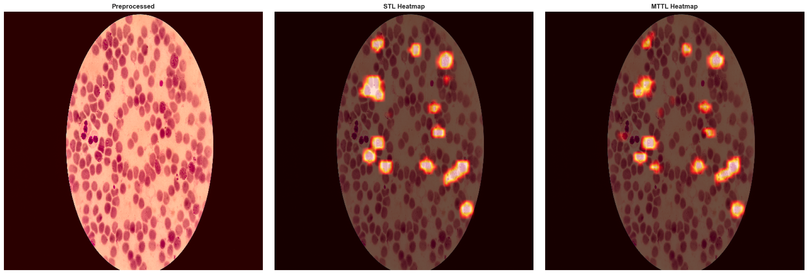

<div align="center">

# Multi-Task Transfer Learning and Application to Malaria Diagnosis

*Master of Science Thesis, November 2025*

</div>

<div align="center">

[**Documentation**](https://github.com/GwadeSteve/MTTL-Research-Malaria) • [**Report Bug**](https://github.com/GwadeSteve/MTTL-Research-Malaria/issues) • [**Request Feature**](https://github.com/GwadeSteve/MTTL-Research-Malaria/issues)

[](https://www.python.org/)
[](https://pytorch.org/)
[](LICENSE)
[](<MSc Document/MSc.pdf>)

</div>

## Overview

This repository contains the complete implementation and experiments for my Master's thesis on Multi-Task Transfer Learning (MTTL) applied to malaria detection. The framework combines Transfer Learning, Multi-Task Learning, and Parameter-Efficient Fine-Tuning to train a unified model that can handle 4 malaria diagnostic tasks simultaneously: multi-class cell detection, binary cell segmentation, infection heatmap generation, and cell classification.

The results show major improvements in robustness compared to traditional single-task approaches and even state-of-the-art object detectors like **YOLOv8** (Nano and Small). By using auxiliary tasks as regularizers, the MTTL framework outperformed an established SOTA YOLOv8-Small by 34% in F1-score for the critical minority class (infected cells) and reduced parasitemia estimation error by over 70%, highlighting the necessity of multi-task learning for reliable medical diagnosis.

## What's Inside

- [Multi-Task Transfer Learning and Application to Malaria Diagnosis](#multi-task-transfer-learning-and-application-to-malaria-diagnosis)
  - [Overview](#overview)
  - [What's Inside](#whats-inside)
  - [System Architecture](#system-architecture)
  - [Key Results](#key-results)
  - [Qualitative Visualizations](#qualitative-visualizations)
- [Getting Started](#getting-started)
  - [Directory Structure](#directory-structure)
  - [Environment Setup](#environment-setup)
  - [Dataset Download](#dataset-download)
  - [Preprocessing](#preprocessing)
  - [Model Weights Download](#model-weights-download)
  - [Training and Evaluation](#training-and-evaluation)
  - [Inference](#inference)
- [Extending the Framework](#extending-the-framework)
  - [Add New Tasks](#add-new-tasks)
  - [Use Different Backbones](#use-different-backbones)
  - [Optimize for Your Hardware](#optimize-for-your-hardware)
- [Citation](#citation)
- [Contact](#contact)

## System Architecture

The system uses a **Hard Parameter Sharing** architecture design, built for efficiency and feature reuse across tasks.

**How it works:**

The shared backbone is a ResNet-50 (pre-trained on ImageNet) with frozen initial layers and trainable LoRA adapters (rank=8) in all residual blocks. Only the final residual block (layer4) gets fine-tuned.

**Feature routing:**
- **Detection & Classification**: Uses a Feature Pyramid Network (FPN) that takes backbone levels C2, C3, and C4 to create rich feature maps
- **Segmentation**: Takes C1 through C4 directly to build high-resolution masks using both low-level spatial details and high-level semantics
- **Localization**: Uses high-resolution features C1 and C2 to keep spatial precision intact

<div align="center">


*High-level overview of the hybrid backbone architecture*
</div>

For detailed diagrams of task-specific heads (Detection's custom Faster R-CNN, Segmentation's U-Net style architecture, Heatmap Regression), check out **Chapter 3.3** in the [thesis PDF](<MSc Document/MSc.pdf>).

## Key Results

I benchmarked the MTTL framework against optimized Single-Task Learning (STL) baselines and industry-standard **YOLOv8** models (Nano and Small) on the complex 3-class detection task (Infected vs. Healthy vs. WBC).

**Detection Performance (3-Class Complexity)**

While STL falls apart as class complexity increases, and YOLOv8 prioritizes the majority class, MTTL uses auxiliary tasks to maintain high sensitivity for the minority 'Infected' class.

<div align="center">

| Configuration | Architecture | mAP@50 | F1 (Infected) |
|:---|:---|:---|:---|
| Det(3) STL | ResNet-50 | 0.3341 | 0.3791 |
| YOLOv8-Nano | CSPDarknet | 0.5871 | 0.5825 |
| YOLOv8-Small | CSPDarknet | 0.6739 | 0.5723 |
| **MTTL Det(3) + RoI** | **ResNet-50 (Hybrid)** | **0.7402** | **0.7710** |

</div>

**Parasitemia Quantification**

Using the WHO formula, I estimated parasitemia on the full test set by comparing cell counts from ground truth annotations against model predictions. MTTL significantly reduces the Mean Absolute Error (MAE) compared to both STL and YOLO baselines, offering superior clinical reliability.

<div align="center">

| Configuration | MAE (%) | Pearson Correlation (r) |
|:---|:---|:---|
| Det (3) STL | 3.30 | 0.8145 |
| YOLOv8-Nano | 2.48 | 0.8830 |
| YOLOv8-Small | 3.78 | 0.5480 |
| **MTTL Det(3) + RoI** | **1.08** | **0.9739** |

</div>

*For the full comprehensive ablation studies, 1-class/2-class/3-class comparisons, refer to **Chapter 4** of the [thesis PDF](<MSc Document/MSc.pdf>).*

## Qualitative Visualizations

The model produces four simultaneous outputs from a single input image. Here are some examples:

**1. 3-Class Detection ( With focus on Infected cells )**

<div align="center">

</div>

**2. Infection Localization Heatmap**

<div align="center">

</div>

**3. Cell Segmentation**

<div align="center">

</div>

# Getting Started

## Directory Structure

```text
.
├── MSc Document/           # Full thesis PDF
├── models/                 # Model configs and weight placeholders
├── Examples/               # Example outputs from models
├── Figure/                 # Architecture diagram
├── Test/                   # Sample image for quick inference tests
├── notebooks/              # Experimental notebooks
│   ├── Phase1_Exploration.ipynb
│   ├── Phase2_Preprocessing.ipynb
│   ├── TrainingEval.ipynb
│   └── SOTA_Comparison.ipynb # Train/Eval against SOTA yolov8(n and s)
├── src/
│   └── utils/
│       ├── download_weights.py     # Script to fetch model weights
│       ├── Components.py           # Neural network modules (Backbone, Heads, LoRA)
│       ├── model.py                # Model assembly and forward pass logic
│       ├── DataUtils.py            # Dataset classes and augmentation pipelines
│       ├── Evaluator.py            # Model evaluation and metrics (mAP, Dice, etc.)
│       ├── Inference.py            # CLI inference tool
│       ├── Losses.py               # Custom loss functions (Focal, Uncertainty, Tversky)
│       ├── MTTLTrainer.py          # Multi-task training
│       ├── STLTrainer.py           # Single-task training
│       ├── experiment_manager.py   # utility for managing all the experiments
│       ├── ReEval.py               # Evaluate any run
│       └── Report.py               # Performance Report
└── requirements.txt
├── ReadMe.md               
├── LICENCE              
```

## Environment Setup

Clone the repository and install dependencies:

```bash
git clone https://github.com/GwadeSteve/MTTL-Research-Malaria.git
cd MTTL-Research-Malaria
pip install -r requirements.txt
```

## Dataset Download

I used the **NIH-NLM Thin Falciparum Blood Smears** dataset:

```bash
# Create directory structure
mkdir -p data/NIH-NLM-ThinBloodSmearsPf

# Download from NLM (about 2GB)
wget -P data/ https://data.lhncbc.nlm.nih.gov/public/Malaria/NIH-NLM-ThinBloodSmearsPf/NIH-NLM-ThinBloodSmearsPf.zip

# Unzip into the data folder
unzip data/NIH-NLM-ThinBloodSmearsPf.zip -d data/
```

## Preprocessing

Before training, the raw data needs to be processed to generate ground truth formats for all tasks (bounding boxes, masks, heatmaps):

```bash
# Execute the preprocessing notebook
jupyter nbconvert --to notebook --execute notebooks/Phase2_Preprocessing.ipynb
```

This script:
1. Applies CLAHE contrast enhancement
2. Resizes images to 512x512
3. Generates Gaussian heatmaps for localization
4. Creates binary masks for segmentation
5. Saves processed tensors to `data/preprocessed_NLM/mttl_training_data`

## Model Weights Download

The repository includes the model configurations, but the large weight files (~1.9GB) must be downloaded separately. You can do this automatically using the provided script.

```bash
# Download weights from Google Drive (requires gdown)
# The script will prompt for confirmation
python src/utils/download_weights.py

# Or to download automatically without prompt:
# echo y | python src/utils/download_weights.py
```

This will populate the `models/` directory with the `.pth` files required for inference.

## Training and Evaluation

Training is managed by `ExperimentManager` in the training notebook.

To reproduce the results:
1. Open the notebook:
   ```bash
   jupyter notebook notebooks/TrainingEval.ipynb
   ```
2. Find the configuration section
3. Select your desired configuration
4. Run it

All artifacts (checkpoints, logs, plots) save automatically to: `experiments/.../[task_name]/run_[id]`

## Inference

I built a command-line interface for running trained models on new images. The tool will automatically attempt to download weights if they are missing.

```bash
python src/utils/Inference.py "Test/Lacuna_Sample.jpg" \
    --task detection \
    --num-classes 3 \
    --mode mttl \
    --models-dir "models" \
    --conf-threshold 0.5 \
    --save-plots \
    --output-dir "inference_results/"
```

**Key arguments:**
- `image_path`: Path to the input image (positional argument)
- `--task`: Which head to visualize (`detection`, `segmentation`, `heatmap`, `roi_classif`)
- `--num-classes`: Detection complexity level the model was trained on (1, 2, or 3)
- `--mode`: Choose `stl` or `mttl`
- `--show-all-classes`: Optional flag. Without it, visualizer focuses on 'Infected' class

For all available flags:
```bash
python src/utils/Inference.py -h
```

# Extending the Framework

This codebase can be adapted for other multi-task problems, whether in medical imaging or other domains. To adapt it for a new application (like tuberculosis detection), you'll need to update the data pipeline, model definition, components, losses, training script, and evaluator.

**Potential applications:**
- Tuberculosis detection in sputum smears
- Leukemia classification in blood cells
- Diabetic retinopathy in fundus images
- Histopathology tumor detection

## Add New Tasks

**Example: Adding parasite life-stage classification**

1. Define the task head:

```python
# In src/utils/Components.py
class LifeStageHead(nn.Module):
    def __init__(self, in_features, num_stages=4):
        super().__init__()
        self.classifier = nn.Sequential(
            nn.Linear(in_features, 128),
            nn.ReLU(),
            nn.Dropout(0.3),
            nn.Linear(128, num_stages)
        )
    
    def forward(self, features):
        return self.classifier(features)
```

2. Add the loss function:

```python
# In src/utils/Losses.py
class LifeStageLoss(nn.Module):
    def __init__(self):
        super().__init__()
        self.ce_loss = nn.CrossEntropyLoss()
    
    def forward(self, predictions, targets):
        return self.ce_loss(predictions, targets)
```

3. Integrate into MTTL trainer:

```python
# In src/utils/MTTLTrainer.py
# Add to loss computation
life_stage_loss = self.losses['life_stage'](outputs['life_stage'], targets['life_stage'])
total_loss += self.task_weights['life_stage'] * life_stage_loss
```

## Use Different Backbones

The framework supports any PyTorch vision backbone:

```python
# In src/utils/model.py
from torchvision.models import efficientnet_b0, convnext_tiny, swin_transformer

# Replace ResNet-50 with your choice
backbone = efficientnet_b0(pretrained=True)
# Or: convnext_tiny(pretrained=True)
# Or: swin_transformer(pretrained=True)
```

**Things to consider:**
- Adjust LoRA injection points based on architecture
- Update feature extraction layers in FPN
- Tune learning rates for your backbone

## Optimize for Your Hardware

**Limited GPU memory?**

```python
# Reduce batch size, increase gradient accumulation
batch_size = 4
gradient_accumulation_steps = 4  # Effective batch size = 16
```

**Multiple GPUs?**

```python
model = nn.DataParallel(model, device_ids=[0, 1, 2, 3])
# Or use DistributedDataParallel for better efficiency
```

**CPU only?**

```python
# Training will be slow but works
device = torch.device('cpu')
# Consider using smaller models or fewer epochs for prototyping
```

# Citation

If you use this code or find the research helpful, please star ⭐ the repo and cite:

```bibtex
@mastersthesis{Gwade2025MalariaMTTL,
  author    = {Gwade, Steve},
  title     = {Multi-Task Transfer Learning and Application to Malaria Detection},
  school    = {National Higher Polytechnic School of Douala, University of Douala},
  year      = {2025},
  month     = {November},
  address   = {Douala, Cameroon},
  url       = {https://github.com/GwadeSteve/MTTL-Research-Malaria}
}
```

# Contact

**Gwade Steve**  
*MSc Data Science and AI*  
*Aspiring Deep Learning Research Engineer*

- Portfolio: [gwadesteve.onrender.com](https://gwadesteve.onrender.com)
- GitHub: [@GwadeSteve](https://github.com/GwadeSteve)
- Repository: [MTTL-Research-Malaria](https://github.com/GwadeSteve/MTTL-Research-Malaria)

**Questions?** Open an issue with the `question` label.

**Want to collaborate?** Reach out via GitHub or start a discussion thread.

**Found this useful?** ⭐ Star the repo and share it!